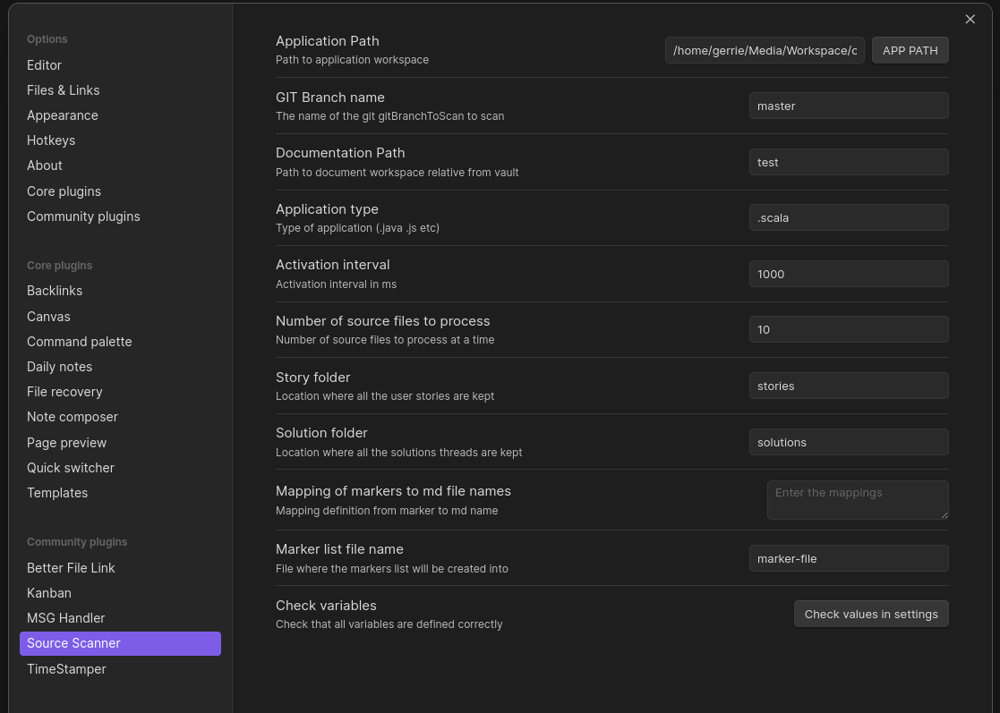

# Source code scanner

## Problem that the plugin tries to address
Developers that uses the agile methodology have a documentation problem. Agile does not mean no documentation , but 
only the necessary documentation. To enable the developer to minimise the work required to be able to show 
how business requirements are met and solved, tools are required.

The simplest solution from a developer point of view is to document the business requirement solution in the code itself.
The ideal place to do this is in the block and line comments of the source code. What you then need are tools to extract these comments and correlate
the comments with the user requirements. The user requirement will be in the form of user stories. 

## Git dependency
The plugin depends on git to check that the current branch is the one to be scanned. To do this you need to add the following git hook shell
script for post-checkout. If you want to fool the code scanner into thinking that the code getting scanned is used version control then create a current-branch.txt
file in the root of the project and place the name of the branch in die file. This branch name value must be the same as defined in the plugin settings.

```agsl
#!/bin/bash
git branch --show-current > current-branch.txt
```

## The use case for this plugin is the following :

0. This plugin is restricted to source languages like java, scala, c, c++, typescript, javascript that have block and line comments. 
1. Scan source code files for comments that is written out to document files in current vault. These comment can include markdown text.
2. Correlate the comments with agile user stories.
3. Create a table of markers along with the documents where the markers appear in. 

## Comments types scanned for in source code

The following type of comments are picked from source files by the plugin and written out markdown  documents ```/** ... */``` and ```//bus ...```. 
The idea is to pick up only comments that relate to the solving of business rules. The other types of comments, ```/* ... */``` and ```// ....``` 
are ignored as they are deemed to be comments that explain some of other technical point in the implementation.

An example of a block comment that is picked is the following
```agsl
  /**
   * ## onload()
   * Load the plugin and setup the commands
   * 1. Add a command to trigger the creation of solution files. Make sure all configs have been done before running the command
   * 2. Add ribbon command to toggle scanning _ON_ or _OFF_. Make sure the scanner have been configured before starting it.
   */
```
This will be rendered as follows in the relevant document md file in the obsidian vault.
# onload()
Load the plugin and setup the commands

1. Add a command to trigger the creation of solution files. Make sure all configs have been done before running the command
2. Add ribbon command to toggle scanning _ON_ or _OFF_. Make sure the scanner have been configured before starting it.

### Comment file naming convention

The scanner must be configured to tell it where the source code is in the file system. Once this is done and the scanner is switched on then the 
document's name will be the fully qualified name of the class being scanned appended by ".md". This is an example of the document name :

crosscut.CrossCuttingConcerns.md

The file scanned is:

crosscut/CrossCuttingConcerns.scala

## Correlation of documents with the user stories
It is now possible to correlate the comment documents with the user stories.

### User stories.
User stories are given to the developer and he/she can create sub stories from these initial stories. By using markers in the 
source comments you are able to create cross cutting concerns w.r.t the solution for the story. 

The markers for the comments are of the form :

```agsl
( |\t)\^([a-zA-Z0-9]+\-)*[a-zA-Z0-9]+\-[0-9]+
```
An example would be: ^story1-00. Once these markers have been placed in the source comments the system can create mappings between the 
documents and the stories. The solution files will the look as follows:


![[stories/update-payment-limits/summary of requirement#^summary]]

![[utils.Lexer.md#^story1-00]]

![[Main.md#^story1-02]]

## Create a table of markers
Once the markers have been placed in the source files then they are essentially lost to the person that wants to generate the solution links 
to the stories. To make it easier to see what marker is in what document and in what sequence, functionality is provided to generate a list of all markers along
with the document file name they are in. 

This should make is easier to update markers in the source code as required.

## User variables that can be set in the plugin settings

 * var applicationPath : String = js.native
 * var gitBranchToScan : String = js.native
 * var documentPath : String = js.native
 * var applicationExtension  : String = js.native
 * var sleepLength: Int    = js.native
 * var groupBySize : Int = js.native
 * var storyFolder : String = js.native
 * var solutionFolder : String = js.native
 * var markerMappings : String = js.native
 * var markersPath : String = js.native

An example of a values that is correct in settings.

